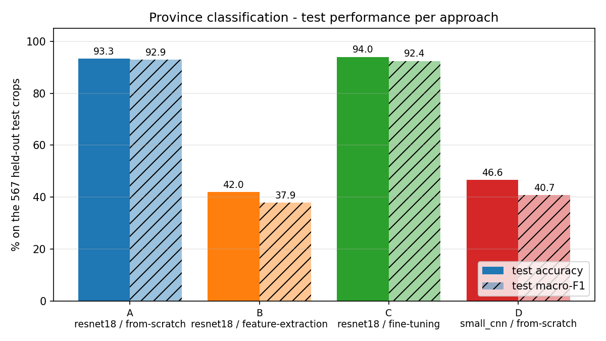
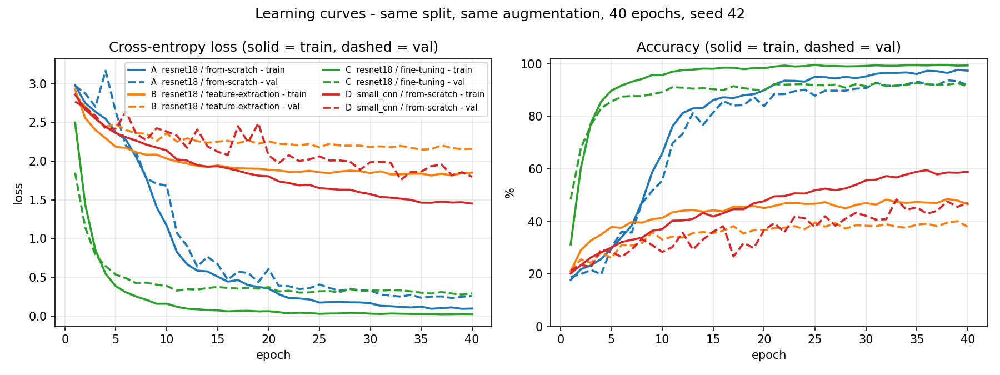

# Khmer Province Classification for Cambodian License Plates — a comparison of four deep-learning approaches

**Student:** <!-- TODO: your full name --> (GitHub: `sobotra`) · **Course:** Deep Learning, Year 2, Kirirom Institute of Technology · **Lecturer:** Mr. Soklong HIM · **Final project, 2026**

> Part of a working ALPR gate-control system (§8). The *graded study* is the
> classifier comparison in §1–§7; the rest of the pipeline is the application it
> serves.

---

## 1. Problem statement

**Task.** Multi-class image classification.
**Input:** a 128 × 128 RGB crop of the top line of a Cambodian license plate (the province name written in Khmer script).
**Output:** one of 26 classes — the 25 Cambodian provinces, or *other* (police / military / state plates that carry no province).

**Why it matters.** A Cambodian plate has three lines: the Khmer province name, the number (`2A-0243`), and the English province name. The number alone does not identify a vehicle — `2A-0243` exists once per province — so a gate that admits registered cars must read the province too. Khmer script is a poor fit for a character-level sequence reader (complex glyph shaping, little training data), so the province is treated as a **whole-image classification problem**. This project asks the course question directly: *for a small, imbalanced Khmer-script dataset, which architecture and training strategy works best, and why?*

## 2. Dataset

| item | value |
|---|---|
| source | crops cut from **Plate_v4** (`taki-dk0de`, Roboflow Universe), a public set of 3 299 Cambodian plate photos — **not self-collected** |
| license | CC BY 4.0 |
| how crops were made | `scripts/recognition/build_province_dataset.py` cuts each labelled province-line box to 128 × 128 and folds Plate_v4's 29 labels into 26 (Cambodia / Police / RCAF / State → *other*) |
| samples | **2 515 train / 529 validation / 567 test** (`data/province_crops/manifest.json`); the identical split is used for every approach |
| test-time preprocessing (all approaches) | resize 128 × 128 → ImageNet mean/std normalisation |
| train-time augmentation (all approaches, identical) | `RandomResizedCrop` (scale 0.6–1.0) + `RandomAffine` (±6°, translate 12 %, scale 0.9–1.1) + `ColorJitter` 0.2 |

**Class distribution** (imbalanced — *other* and Phnom Penh dominate; two provinces have ≤ 20 training crops):

| province | train | val | test |
|---|---|---|---|
| Other | 453 | 97 | 98 |
| Phnom Penh | 254 | 54 | 55 |
| Preah Sihanouk | 148 | 31 | 33 |
| Siem Reap | 147 | 31 | 32 |
| Kampong Cham | 110 | 23 | 25 |
| Prey Veng | 101 | 21 | 23 |
| Takeo | 100 | 21 | 23 |
| Kandal | 97 | 20 | 22 |
| Battambang | 87 | 18 | 20 |
| Svay Rieng | 86 | 18 | 20 |
| Banteay Meanchey | 82 | 17 | 19 |
| Kampong Speu | 77 | 16 | 18 |
| Oudor Meanchey | 72 | 15 | 17 |
| Kampong Chhnang | 70 | 15 | 16 |
| Kampot | 70 | 15 | 15 |
| Pursat | 67 | 14 | 16 |
| Preah Vihear | 65 | 13 | 15 |
| Pailin | 64 | 13 | 15 |
| Kratie | 63 | 13 | 15 |
| Kampong Thom | 62 | 13 | 14 |
| Tboung Khmum | 61 | 13 | 14 |
| Stung Treng | 52 | 11 | 12 |
| Koh Kong | 47 | 10 | 11 |
| Kep | 42 | 9 | 9 |
| Ratanakiri | 20 | 4 | 5 |
| Mondul Kiri | 18 | 4 | 5 |
| **total** | **2 515** | **529** | **567** |

**Known noise / bias (measured, not assumed).**
- **Near-duplicate leakage:** the split was made at *crop* level, and one photo can hold several plates, so 76 of the 567 test crops (**13.4 %**) come from a source photo that also has crops in train/val (`scripts/tools/check_province_leakage.py`; 0 byte-identical files). Every approach is scored on the full test set *and* on the 491-crop clean subset, so the comparison is fair either way.
- Photos are scraped street/parking images: mixed lighting, angles, resolutions; no tilt labels.
- Macro-F1 is reported alongside accuracy because of the imbalance.

## 3. Approaches compared

All four are PyTorch models trained by the same script (`scripts/recognition/train_province_classifier.py`) with the same data, augmentation, 40 epochs, batch 32, Adam, StepLR (×0.5 every 10 epochs), seed 42.

| run | architecture | initial weights | what trains | trainable params | rubric dimension |
|---|---|---|---|---|---|
| **A** | ResNet18 | random | everything | 11 189 850 | training strategy |
| **B** | ResNet18 | ImageNet | **only the final layer** (frozen backbone / linear probe) | 13 338 (0.12 %) | training strategy |
| **C** | ResNet18 | ImageNet | everything, low LR (full fine-tuning) | 11 189 850 | training strategy |
| **D** | small 4-block CNN (32→64→128→256, GAP) | random | everything | 396 058 | architecture |

Why these: A/B/C isolate the *transfer-learning strategy* on one architecture; D asks whether an 11 M-parameter network is even needed for 128-px glyph crops. The `SmallCNN` is defined in `src/recognition/province_classifier.py`; ResNet18 comes from torchvision.

## 4. Experimental setup

- **Metrics:** top-1 accuracy (primary), macro-F1, per-class accuracy, confusion matrix — all on the same 567 held-out crops. Model selection uses **validation** accuracy only.
- **Hyperparameter tuning** (approach C): learning rate {1e-4, 3e-4, 1e-3} × weight decay {0, 1e-4}, 6 runs, selected on validation (`scripts/tools/tune_province.py` → `results/province_study/tuning.csv`).
- **Reproducibility:** `--seed` fixes `random`, NumPy, `torch.manual_seed`, CUDA, cuDNN-deterministic, and the DataLoader shuffle generator. Checkpoints: best-val weights (`torch.save`) plus a full-state `last.pth` every epoch with `--resume`.
- **Hardware:** Google Colab T4 (training); NVIDIA RTX 3050 Laptop 4 GB (evaluation / demo). Per-run wall-time is recorded in each `run.json`.

## 5. Results

<!-- TODO after the Colab runs: paste results/province_study/summary.md here -->

| run | architecture | strategy | trainable params | best epoch | val acc | **test acc** (n=567) | clean-subset acc (n=491) | macro-F1 | train time | hardware |
|---|---|---|---|---|---|---|---|---|---|---|
| A | ResNet18 | scratch | 11 189 850 | — | — | **—** | — | — | — | T4 |
| B | ResNet18 | frozen ImageNet | 13 338 | — | — | **—** | — | — | — | T4 |
| C | ResNet18 | ImageNet fine-tune | 11 189 850 | — | — | **—** | — | — | — | T4 |
| D | small CNN | scratch | 396 058 | — | — | **—** | — | — | — | T4 |

<!-- TODO: embed after running scripts/tools/make_study_figures.py -->



Hyperparameter grid (approach C): <!-- TODO: 2–3 sentences: what was tried, which config won on validation, what the curves showed --> — see `results/province_study/tuning.csv` and `figures/fig6_tuning_heatmap.png`.

## 6. Discussion and error analysis

<!-- TODO after results: fill each bullet with the measured numbers -->
- **Why the winner won** (capacity, transfer, inductive bias, data size): …
- **Learning-curve reading** — over-fitting (train ≫ val) vs under-fitting (both plateau): …
- **Per-class errors vs training-set size** (`figures/fig4_per_class_*.png`): …
- **Failure gallery** (`figures/fig5_failures_*.png`) — visually similar Khmer names, blur, box catching the number line, *other* absorbing province plates: …

**Limitations.** Public dataset, not purpose-collected; 13.4 % near-duplicate rate in the test split (reported, with a clean-subset score); strong class imbalance (18 vs 453 training crops); a 567-image test set gives roughly ±3–4 points of uncertainty on a 95 % score; single seed per configuration unless noted.

**Future work, prioritised.** (1) Re-split by source photo and collect real photos for the five smallest classes. (2) Deploy the rotation-trained classifier variant (already measured: 93 % upside-down vs 19 % for the deployed model). (3) A third architecture family (ConvNeXt-T or a small ViT) at the same budget.

## 7. How to run every experiment

```powershell
# environment (Windows, NVIDIA GPU); CPU works but is slow
python scripts/setup/environment.py
.\.venv\Scripts\activate

# the four approaches (each writes results/province_study/<run>/{history.csv, run.json, test_predictions.csv})
python scripts/recognition/train_province_classifier.py --arch resnet18                      --epochs 40 --seed 42 --lr 1e-3 --run-name A_resnet18_scratch  --out models/recognition/prov_A_scratch.pth
python scripts/recognition/train_province_classifier.py --arch resnet18 --pretrained --freeze --epochs 40 --seed 42 --lr 1e-3 --run-name B_resnet18_frozen  --out models/recognition/prov_B_featext.pth
python scripts/recognition/train_province_classifier.py --arch resnet18 --pretrained          --epochs 40 --seed 42 --lr 1e-4 --run-name C_resnet18_finetune --out models/recognition/prov_C_finetune.pth
python scripts/recognition/train_province_classifier.py --arch small_cnn                     --epochs 40 --seed 42 --lr 1e-3 --run-name D_smallcnn_scratch  --out models/recognition/prov_D_smallcnn.pth

# hyperparameter grid on C, then all tables and figures
python scripts/tools/tune_province.py
python scripts/tools/check_province_leakage.py
python scripts/tools/make_study_figures.py

# Colab: notebooks/colab_transfer_learning.ipynb (A–D) and notebooks/colab_tune_province.ipynb (grid);
# build the upload with  python scripts/tools/make_colab_bundle.py --province-only
```

Trained weights (35–45 MB each): <!-- TODO: Google Drive link to ALPR/trained/prov_*.pth -->

Full annotated tree: [docs/PROJECT_STRUCTURE.md](docs/PROJECT_STRUCTURE.md). A complete walkthrough of the codebase: [PROJECT_UNDERSTANDING.md](PROJECT_UNDERSTANDING.md).

---

## 8. The application: ALPR gate control

The classifier is one of four networks in a real-time gate system that reads a plate, checks it against a SQLite whitelist, and opens an ESP32-driven gate only for a confident, registered match.

```
Camera (phone / RTSP / webcam / folder)
   ├─ YOLOv10-n plate detector   → province crop → ResNet18 classifier (this study) → "ភ្នំពេញ"
   └─ YOLOv10-n number detector  → number crop   → CRNN + CTC reader              → "2A-0243"
                                              compose → "ភ្នំពេញ 2A-0243"
                                     SQLite whitelist → gate decision (fail-safe: default closed)
                                     MQTT → ESP32 gate + audit row + evidence photo
```

| model | file | result (test split) |
|---|---|---|
| plate detector, YOLOv10-n | `models/detection/best.pt` | mAP50 **0.966** (504 images) |
| number detector, YOLOv10-n | `models/detection/number_best.pt` | mAP50 **0.957** (28 images) |
| number reader, CRNN + CTC, 38 chars | `models/recognition/crnn_stn5.pth` | word accuracy **87.2 %** upright / 51.7 % upside-down (149 crops); 84.5 % / 48.5 % on the 97 crops with no plate shared with training |
| province classifier, ResNet18 | `models/recognition/province_classifier_best.pth` | **96.1 %** (567 crops, deployed preprocessing) |

**End-to-end on 149 labelled full scenes** (`scripts/tools/score_pipeline.py`, 2026-09-11): plate found 143/149; **number correct 83.9 %**, **province correct 94.0 %**, both 82.6 %. Zero gate-opens against a whitelist of 137 near-miss plates; one cross-plate misread in 143 in the number-level gate simulation (`metrics/composed_benchmark.json`). Latency ≈ 50 ms/frame on the RTX 3050.

**Gate decision** (`src/core/alpr_system.py::process_frame`, priority order): emergency stop → `REVIEW_REQUIRED`; reader confidence < 0.70 → `REVIEW_REQUIRED`; exact active whitelist match → `ENTRY_ALLOWED`; within one edit of a registered plate → `REVIEW_REQUIRED` (never opens); else `ENTRY_DENIED`. Optional parking mode tracks entry/exit sessions instead of a whitelist.

**Measurement discipline worth knowing about.** `scripts/tools/check_leakage.py` found that 34.9 % of the CRNN test crops shared a plate with training data; the split was cleaned and the lower numbers are the ones reported. `scripts/tools/check_stn.py` proved that the Spatial Transformer layer in the deployed CRNN predicts a near-identity transform — the upside-down reading ability comes from augmentation, and the STN is reported as a negative result. Every number in this README was produced by a script in this repository; `metrics/experiment_log.csv` is the append-only log, each row tagged with its git commit.

**Run the system.**

| command | what it does |
|---|---|
| `python scripts/database/setup.py` | create `plates.db` with demo plates |
| `python scripts/system/system_test.py` | readiness check: GPU, four models, DB, camera, MQTT |
| `python main.py` | interactive menu (dashboard, demo, enroll, admin panel, acceptance test …) |
| `python main.py demo --limit 20` | run the pipeline on real test images |
| `python main.py read <image>` | read one image and offer to enrol it |
| `python scripts/tools/score_pipeline.py` | end-to-end accuracy on the 149 labelled scenes |

`mqtt.enabled: false` (default) runs a mock gate, so no hardware is needed. Every setting lives in `configs/system_config.yaml`. Hardware wiring: [docs/DEPLOYMENT.md](docs/DEPLOYMENT.md); requirements: [docs/srs.md](docs/srs.md); more docs in [docs/](docs/).

**Known limitations of the system:** upside-down plates (detector finds 30 %); few hundred real number crops, so unusual fonts and damaged plates read worse; single-camera parking mode cannot disambiguate two cars with the same misread plate; the ESP32 firmware has been exercised only with the mock gate.

---

## 9. Citations

- **Dataset:** *Plate_v4*, `taki-dk0de`, Roboflow Universe, CC BY 4.0. Number-line boxes (`cambodian-plate-number`, ~280 images) annotated by the author on Roboflow.
- **YOLOv10:** A. Wang et al., *YOLOv10: Real-Time End-to-End Object Detection*, 2024 — via the Ultralytics package; base weights `yolov10n.pt`.
- **ResNet18 / ImageNet weights:** K. He et al., *Deep Residual Learning for Image Recognition*, CVPR 2016 — `torchvision.models.resnet18(weights=ResNet18_Weights.DEFAULT)`.
- **CRNN + CTC:** B. Shi, X. Bai, C. Yao, *An End-to-End Trainable Neural Network for Image-based Sequence Recognition*, TPAMI 2017; A. Graves et al., *Connectionist Temporal Classification*, ICML 2006.
- **Spatial Transformer:** M. Jaderberg et al., *Spatial Transformer Networks*, NeurIPS 2015.
- **Near-duplicate leakage in LPR:** R. Laroca et al., *Do we train on test data? The impact of near-duplicates on license plate recognition*, IJCNN 2023.
- Third-party code: `third_party/yolov10/` (THU-MIG, AGPL-3.0), used only as a reference; the pipeline runs on the Ultralytics package.

## 10. AI-use disclosure

<!-- TODO: read this, correct anything that is not accurate for you, then delete this comment -->
- **Tools used:** Claude (Anthropic) through the Claude Code CLI / VS Code extension.
- **Scope of use:** drafting and refactoring Python scripts and modules (training loops, evaluation tools, the pipeline wrapper), debugging (CUDA/cuDNN crashes, Windows encoding), writing documentation and planning files in `docs/`, transcribing plate numbers from montage sheets to create *training* labels for the CRNN (the 149 CRNN test labels and the 149-scene province ground truth were labelled by me), and analysis write-ups of measured results.
- **Verification:** every reported number was produced by re-running the scripts in this repository (`metrics/experiment_log.csv` records the commit for each measurement); test sets were never used for training (`finetune_crnn.py` raises on any `/test/` row; `check_leakage.py` / `check_province_leakage.py` audit near-duplicates); I have read, and can explain and modify, every line of code in `src/` and `scripts/`. All design decisions, experiments and conclusions are my own.
